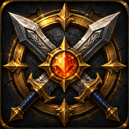

<div align="center">



# PvP Tooltip

**Ranked PvP ratings, personal bests and season stats — right in the player tooltip.**

</div>

<div align="center">

[](https://github.com/Kirom/PvPTooltip/releases/latest)
[](https://github.com/Kirom/PvPTooltip/actions)
[](https://www.curseforge.com/wow/addons/pvp-tooltip)
[](https://addons.wago.io/addons/pvp-tooltip)

[](https://worldofwarcraft.blizzard.com/)
[](https://github.com/Kirom/PvPTooltip)
[](https://github.com/Kirom/PvPTooltip/issues)

[](https://discord.gg/A5N6KEgbCc)

</div>

PvP Tooltip is a World of Warcraft addon that adds ranked PvP information to player tooltips. Hover over any player — in the open world, your group, or Group Finder — and instantly see their current ratings, personal bests and season stats across every competitive bracket. No clicks, no website, no setup.

## Features

- **Ratings for every bracket** — 2v2, 3v3, Solo Shuffle, Rated Battlegrounds and Blitz
- **Personal bests** — all-time peak rating per bracket
- **Season stats** — games played and win rate for the current season
- **Per-spec Shuffle/Blitz** — see each spec's rating, or just active spec
- **Color-coded ratings** — read skill level at a glance
- **In-game settings panel** — toggle sections, brackets and a show-on-modifier key, with a live tooltip preview
- **Multi-region** — EU and US databases, refreshed frequently
- **Cross-realm & cross-faction** lookup, everywhere a unit tooltip appears
- **Minimal footprint** — fast lookups, no measurable performance impact

## What You'll See

Hovering a player adds these sections to the tooltip:

| Section | Shows |
|---------|-------|
| **Current Rating** | Current-season rating for each enabled bracket, color-coded |
| **Character Experience** | All-time personal-best rating per bracket |
| **Current Season** | Games played and win rate per bracket |

For Solo Shuffle and Blitz, ratings are shown **per spec**, with the hovered player's active spec highlighted.

### Color Coding

**Ratings**

| Rating | Color | Tier |
|--------|-------|------|
| 0–1799 | White | Unrated / Low |
| 1800–2099 | Green | Rival / Combatant |
| 2100–2399 | Blue | Challenger / Elite |
| 2400+ | Purple | Gladiator |

**Stats** — Games played: gold · Win rate ≤50%: red · Win rate >50%: green.

## Installation

### Addon managers (recommended)

- **CurseForge** — search **"PvP Tooltip"** and install
- **Wago** — search **"PvP Tooltip"** and install
- **WowUp** — installs directly from GitHub releases

### Manual

1. Download the latest release from [GitHub Releases](https://github.com/Kirom/PvPTooltip/releases/latest).
2. Extract the `PvPTooltip` folder into your AddOns directory:
   - **Windows**: `World of Warcraft\_retail_\Interface\AddOns\`
   - **macOS**: `Applications/World of Warcraft/_retail_/Interface/AddOns/`
3. Restart WoW or `/reload`.
4. Confirm **PvP Tooltip** appears in your AddOns list, then hover any player.

## Configuration

PvP Tooltip works out of the box — configuration is optional.

### Settings panel

Open it any of these ways:

- Type `/pvpt` (or `/pvptooltip`)
- `Esc → Options → AddOns → PvPTooltip`

The panel includes a **live tooltip preview** that updates as you change options:

- **Show info when** — Always, or only while holding **Shift / Ctrl / Alt** (great for keeping tooltips clean)
- **Sections** — toggle Current Rating, Character Experience, Current Season
- **Brackets** — show/hide 2v2, 3v3, Solo Shuffle, RBG, Blitz individually
- **Display** — show all specs vs only the hovered spec; hide brackets with no games

### Slash commands

| Command | Action |
|---------|--------|
| `/pvpt` · `/pvpt config` | Open the settings panel |
| `/pvpt enable` · `/pvpt disable` | Toggle the addon |
| `/pvpt status` | Show current state |
| `/pvpt debug` | Toggle debug logging |
| `/pvpt force` | Force addon to ready state (troubleshooting) |

Unknown or missing arguments print this command list to chat.

## Supported Contexts

Tooltips are enhanced wherever a unit tooltip shows: open-world players, party and raid members, Group Finder listings and applicants, guild and friends lists, battlegrounds and arenas.

## Data Freshness

Player rating data ships as separate per-region add-ons — **PvPTooltip_DataEU** and **PvPTooltip_DataUS** — so only your region's database loads. Realm and region mapping data lives in `src/db/` and loads with the main addon. All are generated externally and refreshed frequently from current ranked data. For the most accurate ratings, **keep the addon updated** (enable auto-update in your addon manager, install all bundled add-ons).

| Database | Add-on | Contents |
|----------|--------|----------|
| `db_pvp_eu_characters.lua` | PvPTooltip_DataEU | EU player ratings |
| `db_pvp_us_characters.lua` | PvPTooltip_DataUS | US player ratings |
| `db_realms.lua` | PvPTooltip | Realm mappings |
| `db_regions.lua` | PvPTooltip | Region detection |

> These files are generated externally — do not hand-edit them.

## Requirements

- **World of Warcraft**: Retail — Midnight (Interface `120007`)
- **Dependencies**: none (standalone)

## Project Structure

```
PvPTooltip/
├── PvPTooltip.toc          # Metadata + load order (TOC order = dependency order)
├── Media/                  # In-game textures (addon list icon)
├── src/
│   ├── Core/               # Lifecycle, config, events, errors, performance
│   ├── Data/               # Player lookup + realm/region resolution
│   ├── UI/                 # Tooltip rendering + settings panel
│   └── db/                 # GENERATED realm/region databases
├── data/
│   ├── PvPTooltip_DataEU/  # GENERATED per-region character add-on (EU)
│   └── PvPTooltip_DataUS/  # GENERATED per-region character add-on (US)
├── scripts/                # Lint + release automation
├── ReleaseNotes/           # Per-version notes
├── CHANGELOG.md
└── LICENSE
```

## Development

```bash
# Lint
./luacheck.exe src/ --config .luacheckrc

# Prepare + ship a release (bumps notes, tags, pushes → CI publishes)
./scripts/prepare-release.sh v1.0.1
```

Releases are fully automated via GitHub Actions — tagging `v*` packages the addon and publishes to CurseForge and Wago, then announces in Discord. See [RELEASE_PROCESS.md](RELEASE_PROCESS.md) for the full flow.

## Contributing

1. Fork and create a feature branch.
2. Run `./luacheck.exe src/ --config .luacheckrc` before committing.
3. Use [Conventional Commits](https://www.conventionalcommits.org/) (`type(scope): subject`).
4. Open a Pull Request.

Bug reports and feature requests are welcome via [GitHub Issues](https://github.com/Kirom/PvPTooltip/issues) or the Discord.

## Changelog

See [CHANGELOG.md](CHANGELOG.md) for the full version history.

## Support & Community

- **Discord** — [join the server](https://discord.gg/A5N6KEgbCc) for help, bug reports and feature ideas
- **GitHub Issues** — [report a bug or request a feature](https://github.com/Kirom/PvPTooltip/issues)

## License

MIT — see [LICENSE](LICENSE).

---

<div align="center">

**Happy PvP hunting!** 🗡️⚔️

</div>
